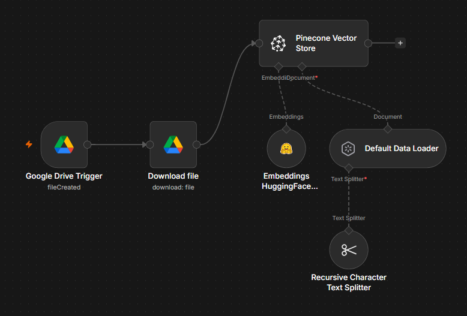
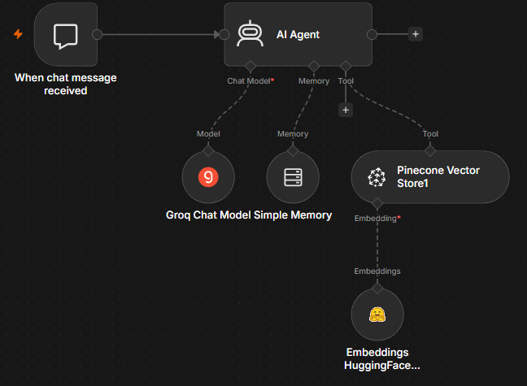

# Document Q&A Chatbot with n8n, Pinecone, and Groq

An automated pipeline that turns files dropped into Google Drive into a searchable knowledge base, then lets users chat with that knowledge base through an AI agent.

The project has two workflows: one that ingests and indexes documents, and one that handles live chat conversations using the indexed data.

## How It Works

### 1. Document Ingestion Workflow

This workflow watches a Google Drive folder and automatically processes any new file into the vector database.

**Flow:**
- **Google Drive Trigger** — fires when a new file is created in the watched folder
- **Download file** — pulls the file content from Drive
- **Default Data Loader** — reads and prepares the document content
- **Recursive Character Text Splitter** — breaks the document into smaller chunks for better retrieval accuracy
- **Embeddings (HuggingFace)** — converts each chunk into a vector embedding
- **Pinecone Vector Store** — stores the embeddings so they can be searched later

Once this runs, any new document added to the folder is automatically embedded and indexed, no manual steps required.

### 2. Chat Agent Workflow

This workflow powers the actual conversation. It takes a user's message, retrieves relevant context from Pinecone, and responds using an LLM.

**Flow:**
- **When chat message received** — entry point that listens for incoming user messages
- **AI Agent** — the core node that orchestrates the conversation
- **Groq Chat Model** — the LLM that generates responses
- **Simple Memory** — keeps track of conversation history so the agent has context across turns
- **Pinecone Vector Store (as a Tool)** — lets the agent search the indexed documents and pull in relevant chunks before answering

The agent decides when to query the vector store based on the user's question, then combines the retrieved context with the conversation history to generate an answer.

## Tech Stack

| Component | Tool |
|---|---|
| Automation platform | n8n |
| File source | Google Drive |
| Vector database | Pinecone |
| Embeddings | HuggingFace |
| LLM | Groq |
| Text chunking | Recursive Character Text Splitter |

## Why This Setup

- **No manual re-indexing** — new files are picked up and embedded automatically
- **Context-aware answers** — retrieval augmented generation means responses are grounded in the actual documents, not just the model's general knowledge
- **Conversational memory** — the agent remembers earlier turns in the chat, so follow-up questions work naturally
- **Modular** — each node can be swapped out (e.g. a different LLM or vector store) without rebuilding the whole workflow

## Possible Next Steps

- Add file type filtering on the Google Drive trigger (e.g. only process PDFs/docs)
- Add a fallback response when Pinecone returns no relevant matches
- Log conversations for later review
- Add authentication/user identification to the chat trigger
